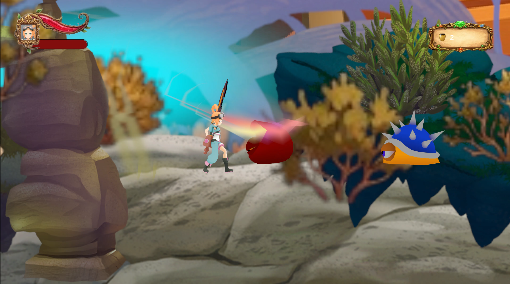

# RiftStorm — 2.5D Action Platformer
 
A 2.5D side-scrolling action platformer with 3D characters moving on a 2D plane.
Built in Unity 6 (URP).
 
## Gameplay
 
Fight through two levels of platforming combat. Collect gems, defeat enemies,
and take down the boss to reach the portal. Health and progress persist between levels.
 
[▶ Watch Gameplay](https://tinyurl.com/RiftStorm-Gameplay-Video)
 
## Download & Play
 
[Download Playable Build (Windows)](https://tinyurl.com/RiftStorm-Playable-Build)
 
**How to run:**
1. Download and extract the zip file
2. Run the .exe file
3. No installation required
## Screenshots
 

 
## Core Systems
 
### Enemy Architecture
Inheritance-based enemy system. `Enemy` base class with virtual `HurtSequence()`
and `DeathSequence()` methods. `PatrollingEnemy` and `BossSlime` override these
via polymorphism — adding new enemy types requires zero changes to existing code.
 
### Boss AI State Machine
BossSlime uses a FixedUpdate state machine: idle → chase → attack based on
distance thresholds. `isAttacking` is set to true BEFORE `StartCoroutine()`
to prevent coroutine stacking from repeated FixedUpdate calls — a subtle but
critical ordering decision.
 
### Animation Event System
Attack hitbox activation driven by Animation Events at precise animation frames.
`ActivateAttack()` and `ResetAttack()` are called at exact frames — frame-perfect
hitbox timing with no approximations or manual timers.
 
### Scene Management & Persistence
`GameManager` singleton with `DontDestroyOnLoad`. `Fader` script uses Animation
Events to trigger scene loads at the exact end frame of a fade animation.
`PlayerPrefs` persists health, gem count, and saved level index across scene loads.
 
### Input System
Unity New Input System with clean separation of concerns — `GatherInput` reads
input, `PlayerMoveControls` and `PlayerAttckControls` consume it independently.
 
## Key Scripts
 
| Script | Purpose |
|--------|---------|
| `GameManager.cs` | Singleton scene controller, gem registry, fader coordination |
| `Enemy.cs` | Base class — TakeDamage, virtual HurtSequence/DeathSequence |
| `BossSlime.cs` | State machine AI, coroutine stacking prevention |
| `PatrollingEnemy.cs` | Ground patrol with edge and wall detection |
| `PlayerMoveControls.cs` | Rigidbody2D movement, knockback coroutine, ground detection |
| `PlayerAttckControls.cs` | Animation event-driven hitbox, sword trail VFX |
| `Fader.cs` | Cinematic scene transitions via Animation Events |
| `PlayerStats.cs` | Health system, invincibility frames, PlayerPrefs persistence |
| `Portal.cs` | Level completion trigger using GetComponentInParent |
| `SetLevel.cs` | Auto-saves current scene index for Continue functionality |
| `MovePlatform.cs` | Moving platform with player parenting on collision |
| `GatherInput.cs` | New Input System — move, jump, attack input separation |
 
## Technical Highlights
 
- Coroutine stacking prevention — `isAttacking` set before `StartCoroutine()` in FixedUpdate
- `GetComponentInParent` for trigger detection regardless of which child collider fires
- `Awake` vs `Start` distinction — `AudioToggle` uses `Awake` because parent starts inactive
- Moving platform with player parenting on `OnCollisionEnter2D` / `OnCollisionExit2D`
- Animation Event-driven scene loading — timing controlled by animation, not code timers
- Full keyboard and gamepad UI navigation with separate Submit and Navigate input actions
## Built With
 
- Unity 6 (URP)
- C#
- Unity New Input System
- Cinemachine
- PlayerPrefs for cross-scene persistence
- ProBuilder (Level 2 environment)
## Developer
 
Sami Jabarti
[github.com/Weirdo1-1](https://github.com/Weirdo1-1)
 
